<!-- GENERATED by `python -m freshcart.docs` from docs_src/. Edit the template, not this file. Every table and number below comes from running the pipeline. -->

# AI-ready retail data for Databricks Genie: a complete, runnable demo

This repository takes **messy, realistic retail source data** and turns it, step by step, into
**AI-ready data** that a conversational analytics agent (Databricks Genie) can answer from correctly.

Everything is real and runnable:

- **Synthetic source data** for a fictional grocer, FreshCart: 9 stores in the US and Canada,
  98,192 POS lines, 8,288 online orders,
  52,052 stock snapshots, plus product, store, loyalty, promotion, calendar and FX feeds.
  The files are deliberately messy in the ways real retail feeds are messy.
- **A medallion pipeline** (bronze → silver → gold) that fixes every problem, written in SQL, one file per step.
- **A semantic layer**: two Unity Catalog metric-view definitions and a trusted like-for-like function.
- **A Genie Agent configuration**: data sources, entity matching, SQL expressions, example queries,
  instructions and a 15-question benchmark suite with the expected answers.
- **Documentation for every step**, showing real rows before and after each transformation.
- **A Databricks version** of every step, ready to deploy in Unity Catalog.

The local demo runs on **plain Python + SQLite** (built into Python), so you can run it on a
laptop in about 20 seconds with no Databricks workspace and no database to install.

> Companion to the article *"Making Retail Data AI-Ready for Databricks Genie"*.
> FreshCart and all of its data are fictional.

---

## Quick start

```bash
git clone <this repo>
cd ai-ready-retail-data-genie-demo
pip install -r requirements.txt        # only PyYAML
python run_demo.py                     # pipeline + checks + benchmarks + docs, about 20 seconds
python tests/run_tests.py              # 13 tests, including a raw-to-gold reconciliation
```

Want to poke at the data yourself? The warehouse is three SQLite files in `warehouse/`
(`bronze.db`, `silver.db`, `gold.db`). Open them with any SQLite tool, or browse the CSV
snapshots in [`data/exports/`](data/exports/). To see a Genie-style question answered from the metric view:

```bash
python -c "from freshcart.db import connect; from freshcart import metrics; \
print(metrics.run(connect(), \"SELECT region, MEASURE(net_sales) AS net_sales FROM freshcart.semantic.sales_metrics WHERE is_last_completed_fiscal_week GROUP BY ALL\"))"
```

---

## Architecture

```mermaid
flowchart LR
  subgraph SRC["Source systems (data/raw)"]
    direction TB
    POS["POS log<br/>monthly CSV"]
    WEB["E-commerce<br/>NDJSON"]
    ERP["ERP products<br/>+ costs"]
    STO["Store master<br/>snapshots"]
    CRM["Loyalty CRM<br/>(personal data)"]
    PRM["Promotions"]
    INV["Inventory<br/>snapshots"]
    FIN["Fiscal calendar<br/>+ FX rates"]
  end
  subgraph BRZ["Bronze: land as delivered"]
    B1["15 raw tables<br/>all text + audit columns<br/>incremental by file"]
  end
  subgraph SLV["Silver: clean and conform"]
    direction TB
    S1["pos_sales_line<br/>online_sales_line"]
    S2["store_history (SCD2)<br/>product, product_cost<br/>promotion, loyalty_member"]
    S3["inventory_daily<br/>fiscal_calendar, fx_rate_daily"]
    SQ["quarantine_pos_sales_line"]
  end
  subgraph GLD["Gold: business star schema"]
    direction TB
    F1["fct_sales_line"]
    F2["fct_inventory_daily"]
    D1["dim_date · dim_store · dim_product<br/>dim_customer · dim_promotion"]
  end
  subgraph SEM["Semantic layer"]
    M1["metric view<br/>sales_metrics"]
    M2["metric view<br/>inventory_metrics"]
    FN["trusted function<br/>fn_like_for_like_sales"]
  end
  GEN["Genie Agent<br/>FreshCart Sales &<br/>Stock Assistant"]
  USR(["Business users"])
  SRC --> BRZ --> SLV --> GLD --> SEM --> GEN --> USR
  D1 -. entity matching .-> GEN
```



Unity Catalog governs every layer on Databricks: comments and tags, primary/foreign keys,
row filters on the facts, column masks on personal data, lineage, certification and audit.
See [docs/00-architecture.md](docs/00-architecture.md) for the table-level lineage and the star schema.

## What each layer holds

| layer | example_table | rows | what_changed |
|---|---|---|---|
| bronze | pos_tlog_raw | 98,192 | raw text exactly as delivered, duplicates and bad rows included |
| silver | pos_sales_line | 98,053 | typed, decoded, deduplicated, signed, USD; bad rows quarantined |
| gold | fct_sales_line | 145,866 | POS + online stacked; voids, cancellations and test sales removed; margin calculated |
| semantic | sales_metrics |  | 15 governed measures such as net_sales, gross_margin_pct, average_basket_value |

---

## Learning path

Read the docs in order. Each one shows the real data before and after its step.

| # | Doc | What you learn |
|---|---|---|
| 0 | [Architecture](docs/00-architecture.md) | The whole system, table lineage, star schema, local vs Databricks |
| 1 | [The business and its questions](docs/01-business-and-questions.md) | Start from the questions, not the tables |
| 2 | [Source data](docs/02-source-data.md) | Every raw feed and the problems planted in it |
| 3 | [Bronze](docs/03-bronze.md) | Landing data unchanged, incremental file ingestion |
| 4 | [Silver](docs/04-silver.md) | Typing, decoding, deduplication, SCD2, FX, pseudonymisation, quarantine |
| 5 | [Gold](docs/05-gold.md) | How each dimension and fact is built from silver |
| 6 | [Semantic layer](docs/06-semantic-layer.md) | Metric views, ratio-of-sums, semi-additive stock, like-for-like |
| 7 | [Genie Agent](docs/07-genie-agent.md) | The agent configuration, example queries and benchmark answers |
| 8 | [Follow one receipt](docs/08-trace-one-receipt.md) | One receipt traced from raw file to Genie answer |
| 9 | [Run it on Databricks](docs/09-run-on-databricks.md) | Deploying the same design in Unity Catalog |
| 10 | [Data dictionary](docs/10-data-dictionary.md) | Every gold column with its comment |
| 11 | [Data quality](docs/11-data-quality.md) | Rules, findings and the reconciliation test |

New to data engineering? Start with the notebook
[`notebooks/FreshCart_Data_Transformation_Walkthrough.ipynb`](notebooks/FreshCart_Data_Transformation_Walkthrough.ipynb).
It teaches the theory first (grain, keys, medallion layers, star schemas, SQL window functions), then rebuilds every
bronze, silver and gold table from the raw files, one step at a time, explaining each transformation and why it is needed.
Run it with `pip install -r notebooks/requirements.txt` and `jupyter notebook notebooks/`.

Taking the Genie space to production? It is delivered as a Declarative Automation Bundle in
[`genie_bundle/`](genie_bundle/) (targets sandbox, dev, qa, prod), with version history for every change made in the dev
space, rollback, benchmark gates, approvals and drift protection in [`.github/workflows/genie-*.yml`](.github/workflows/).
The complete guide, which runs the real Databricks CLI end to end, is
[`notebooks/Genie_CICD_with_Declarative_Automation_Bundles.ipynb`](notebooks/Genie_CICD_with_Declarative_Automation_Bundles.ipynb).

## Repository map

```text
data/raw/            synthetic source files, exactly as source systems deliver them (committed)
data/exports/        CSV snapshots of silver and gold for browsing (regenerated by run_demo.py)
freshcart/           Python: generator, bronze loader, pipeline runner, metric engine, docs renderer
pipeline/silver/     one SQL file per silver table, steps numbered in comments
pipeline/gold/       one SQL file per gold table, steps numbered in comments
contracts/gold/      YAML contract per gold table: columns, types, comments, keys, tags
semantic/            metric-view YAML (used locally AND on Databricks) + like-for-like function
genie/               Genie Agent config, instructions, example queries, benchmarks
databricks/          the Databricks version: setup, Lakeflow pipeline, gold MERGEs, governance, metric views
tests/               13 tests incl. raw-to-gold reconciliation
docs_src/ -> docs/   documentation templates and the rendered docs with real numbers
notebooks/           walkthrough notebooks: every table step by step; Genie version control and CI/CD
genie_bundle/        Declarative Automation Bundle: Genie space + quality-gate job, targets sandbox/dev/qa/prod
```

## Design decisions in one list

1. **Model for questions**: a star schema at a declared grain, pre-joined where it removes ambiguity.
2. **Speak the business's language**: full-word names, units in names, codes decoded to labels.
3. **Put meaning in metadata**: every gold table and column has a comment; keys are declared.
4. **Define every metric once**: in a metric view, used by Genie, dashboards and notebooks alike.
5. **Precompute the hard parts**: fiscal calendar, rolling flags, comparable stores, FX, sign conventions.
6. **Govern in the data**: row filters on facts, no personal data in gold, masks on the restricted table.
7. **Treat accuracy as a test suite**: data-quality rules, a reconciliation test and Genie benchmarks.

## Disclaimer

FreshCart, its stores, products, customers and numbers are fictional. The Databricks SQL in
`databricks/` follows the Databricks documentation as of September 2026 but is not executed by
this repo's tests; the local SQLite version is the tested reference. Review and test before
production use.
