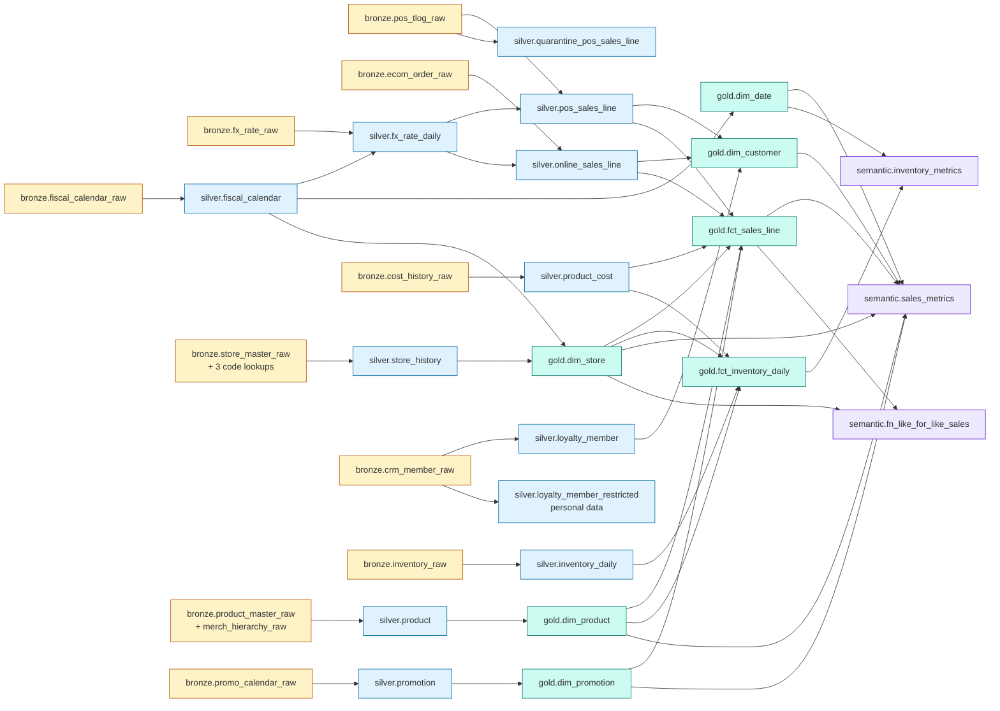
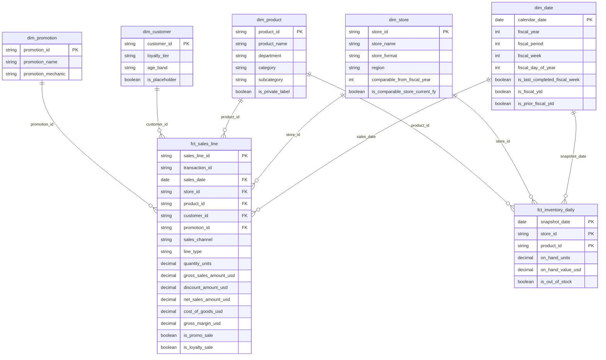
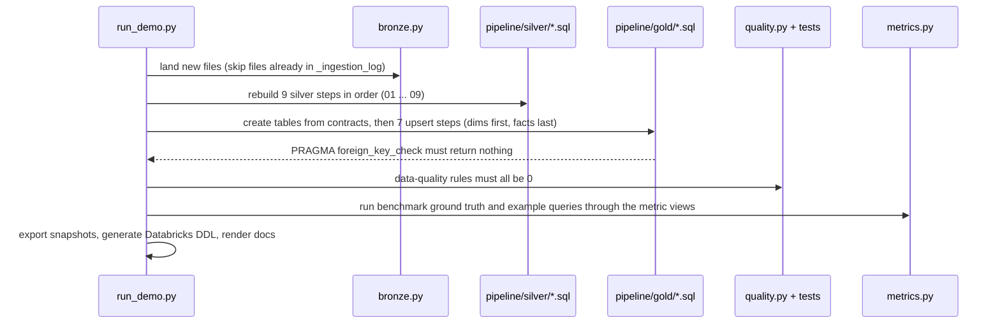

<!-- GENERATED by `python -m freshcart.docs` from docs_src/. Edit the template, not this file. Every table and number below comes from running the pipeline. -->

# 0 · Architecture

[← Back to README](../README.md) · Next: [1 · The business and its questions →](01-business-and-questions.md)

## The layers and their contracts

| Layer | Purpose | Rule of thumb | Attached to Genie? |
|---|---|---|---|
| **Landing** (`data/raw`) | Files exactly as source systems deliver them | Never edited | No |
| **Bronze** | One raw table per feed | Everything as text, plus `_source_file`, `_row_number`, `_ingested_at`. Load each file once. | No |
| **Silver** | Clean, typed, decoded, conformed | Keep every *valid* source row (voids and cancellations included, flagged). Reject broken rows to a quarantine table with a reason. | No |
| **Gold** | Business star schema | Only what counts for the business. Declared grain, keys, comments, Unknown members. | Two dimensions (for lookups and entity matching) |
| **Semantic** | Governed metrics | Every KPI defined once. Ratios composed from sums. Stock is semi-additive. | Yes: two metric views and one trusted function |

## Table-level lineage

Every arrow is a join or a union in a SQL file you can open. Follow any gold column back to its raw file.

Notice what does **not** flow into gold: `quarantine_pos_sales_line` (broken rows, kept for fixing at source)
and `loyalty_member_restricted` (email, card number, date of birth).

## The gold star schema

Every foreign key resolves: each dimension has an explicit **Unknown member** (`UNKNOWN`, `ANONYMOUS`,
`NO_PROMO`), so a fact row never has a NULL key and an inner join never drops a sale. Locally,
SQLite **enforces** the keys; the pipeline fails if any foreign key is broken. On Databricks the same
keys are declared as informational constraints (`PRIMARY KEY ... RELY`), and Genie reads them as join relationships.

## How a run flows

## Local demo vs Databricks

| Concept | Local demo (tested) | Databricks (in `databricks/`) |
|---|---|---|
| Catalog / schemas | `bronze.db`, `silver.db`, `gold.db` attached as schemas | `freshcart.bronze`, `.silver`, `.gold`, `.semantic` in Unity Catalog |
| Landing zone | `data/raw/` | Volume `/Volumes/freshcart/landing/raw/` |
| Incremental file ingestion | `bronze._ingestion_log` | Streaming tables with `read_files` (Auto Loader) |
| Silver transformations | `pipeline/silver/*.sql` | Lakeflow Declarative Pipeline `databricks/pipelines/02_silver.sql` |
| Data-quality rules | quarantine table + `quality.py` | `CONSTRAINT ... EXPECT ... ON VIOLATION DROP ROW` + quarantine view |
| Gold tables | `CREATE TABLE ... STRICT` from contracts, enforced PK/FK | `CREATE TABLE ... COMMENT ... PRIMARY KEY ... RELY` from the same contracts |
| Gold loads | `INSERT ... ON CONFLICT DO UPDATE` | `MERGE INTO ... WHEN MATCHED ... WHEN NOT MATCHED` |
| Column comments | `gold._column_comments` table | Unity Catalog `COMMENT` (read by Genie) |
| Metric views | `freshcart/metrics.py` reads `semantic/*.yaml` | `CREATE VIEW ... WITH METRICS LANGUAGE YAML` with the same YAML |
| Trusted function | `semantic/fn_like_for_like_sales.local.sql` | `CREATE FUNCTION ... RETURNS TABLE` |
| Security | not simulated | Row filters on facts, column masks, grants |
| "Today" | pinned `AS_OF_DATE = 2026-09-27` for reproducible numbers | `current_date()` |

Next: [1 · The business and its questions →](01-business-and-questions.md)
